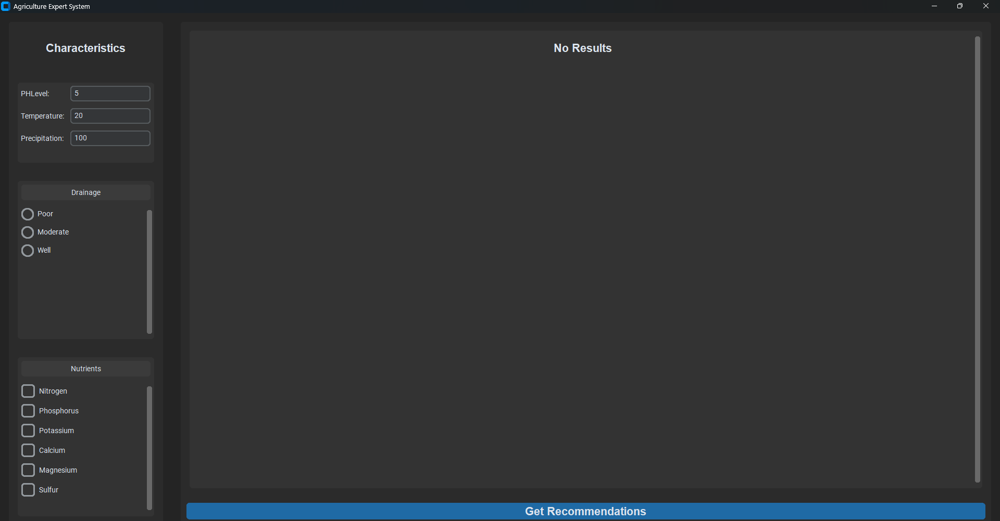
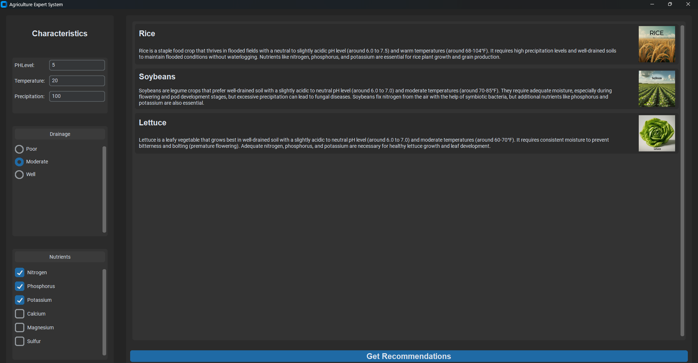

# Agriculture Knowledge Base

This expert system helps farmers make informed decisions about which crop to plant based on soil and climate data. It provides recommendations for the best crop to plant for optimal yield and sustainability.

## Features

- Analyzes soil and climate data to recommend the best crop to plant.
- Provides actionable recommendations based on a comprehensive knowledge base of agricultural data.
- Tailored to optimize yield and sustainability.

## Data Inputs

Provide the following data for analysis:

- **Soil Data**:
    - `pH level`: e.g., 6.5 (slightly acidic)
    - `Nutrient content`: e.g., low nitrogen, adequate phosphorus, and potassium
    - `Drainage properties`: e.g., well-draining or moderate drainage

- **Climate Data**:
    - `Average daily temperature`: e.g., 25°C (77°F)
    - `Annual precipitation`: e.g., 800 mm (31.5 inches)
    - `Sunlight hours per day`: e.g., 10 hours

## Output

After analyzing the input data, the system provides a recommendation for the best crop to plant based on the conditions provided:

- **Best Crop to Plant**: The crop that matches the given soil and climate data for optimal yield and sustainability.
# Screenshots :
- The user inputs the soil and environmental data in descending order of importance, starting from the top and moving downwards

- The user clicks the 'Get Recommendation' button to receive suggested crops along with a brief description and image, accompanied by an explanation of why the system generated this particular crop recommendation.

## Usage

1. **Clone the Repository**
    ```bash
    git clone https://github.com/your-username/agriculture-knowledge-base.git
    ```

2. **Input Data**
    - Prepare your soil and climate data as outlined in the [Data Inputs](#data-inputs) section.
3. **Run the Interface**
    - Run the Interface/Interface.py file to start the program 
4. **Run the Analysis**
    - Use the system to analyze the input data and get recommendations for the best crop to plant.

5. **Follow the Recommendation**
    - Plant the recommended crop as advised by the system for the best chance of success.
